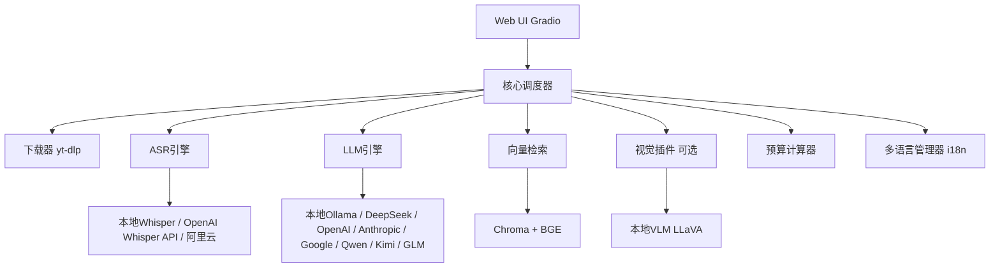

# 项目技术设计文档  
**项目名称**：VideoSum —— 本地智能视频总结与课件生成工具  
**版本**：v1.0 (MVP + 增强)  
**许可证**：MIT 或 Apache 2.0（待定）  
**开发语言**：Python 3.10+  
**UI框架**：Gradio 4.x（美观主题 + 自定义 CSS/JS）  
**发布格式**：PyInstaller 打包为各平台可执行文件 + pip 安装版  
**支持语言**：中文（简体）/ English / Deutsch

---

## 1. 项目目标

- **输入**：任意视频 URL（B站、YouTube 等，由 yt-dlp 支持），同时支持本地视频导入，本地MP3音频导入。
- **输出**：
  - 带时间戳的结构化文字总结（Markdown / HTML）
  - 基于全文或总结的问答交互
  - 接入联网搜索API或者接入cherry studio以获得更多支持
  - （可选）视觉增强：关键帧截图 + 图文笔记
  - 复习课件（含图文的复习卡片）
- **特色**：
  - **本地 / 云端后端无缝切换**（ASR + LLM）
  - **一键安装配置**（自动检测依赖、下载模型、引导密钥）
  - **成本透明**：每次云端处理前估算 token 消耗与费用
  - **隐私友好**：所有本地处理数据不上传
  - **多语言支持**：UI和输出支持中/英/德三语

---

## 2. 系统架构



**核心调度器**：控制流程、异常处理、降级策略、进度回调。  
**配置管理器**：读写 `~/.videosummary/config.yaml`，提供 GUI 配置面板。  
**插件管理器**：动态加载视觉增强插件（默认未安装，用户可以通过GUI点击按钮进行安装，按钮中封装有自动下载的逻辑），并设置插件商店，开放api接口，使本项目具备可拓展性。  
**多语言管理器**：管理UI翻译、LLM输出语言、ASR语言检测。

---

## 3. 模块详细设计

### 3.1 配置管理 (`config_manager.py`)

**配置项结构**（YAML）：

```yaml
app:
  output_dir: "~/Videos/SummaryOutput"
  temp_dir: "~/tmp/videosummary"
  keep_temp_files: false
  language: "zh"  # zh, en, de

asr:
  backend: "local"  # local, openai, aliyun, google
  local:
    model_size: "large-v3"  # tiny, base, small, medium, large, large-v3
    device: "auto"  # auto, cuda, cpu
    compute_type: "float16"  # int8_float16, float16, int8
  openai:
    api_key: ""
  aliyun:
    access_key_id: ""
    access_key_secret: ""
    app_key: ""
    region: "cn-shanghai"
  google:
    api_key: ""

llm:
  backend: "deepseek"  # openai, anthropic, google, deepseek, qwen, kimi, glm, ollama
  openai:
    api_key: ""
    model: "gpt-4.1-mini"
  anthropic:
    api_key: ""
    model: "claude-sonnet-4-20250514"
  google:
    api_key: ""
    model: "gemini-2.5-flash"
  deepseek:
    api_key: ""
    model: "deepseek-chat"
  qwen:
    api_key: ""
    model: "qwen-plus"
  kimi:
    api_key: ""
    model: "moonshot-v1-128k"
  glm:
    api_key: ""
    model: "glm-4-plus"
  ollama:
    model: "qwen2.5:7b"
    context_length: 8192
  temperature: 0.3
  max_tokens: 4000

visual:
  enabled: false  # 需要安装插件后手动设置为 true
  backend: "local"
  local:
    model: "llava:7b"  # Ollama 模型
    frame_interval: 10  # 秒
    min_scene_change_threshold: 30  # 场景变化检测阈值

rag:
  embedding_model: "BAAI/bge-m3"
  chroma_persist_dir: "~/.videosummary/chroma_db"

budget:
  currency: "CNY"  # CNY, USD
  warn_threshold: 5.0  # 超过此费用弹出警告
```

**配置编辑器**：在 UI 的"设置"页面中提供表单，保存后自动更新配置。

### 3.2 下载模块 (`downloader.py`)

- 使用 `yt-dlp` 提取最佳音频流（或视频流，若视觉插件启用）
- 支持 cookies 导入（用于会员视频）
- 返回本地文件路径及元数据（标题、时长、上传者）
- 自动检测视频语言

### 3.3 ASR 引擎抽象 (`asr/`)

**接口**：
```python
def transcribe(audio_path: str, progress_callback=None) -> TranscriptionResult:
    # TranscriptionResult包含segments, language, duration等
```

**实现类**：
- `LocalWhisperASR`：调用 `faster_whisper`，自动处理分段、设备选择。
- `OpenAIWhisperASR`：调用OpenAI Whisper API，$0.006/分钟。
- `AliyunASR`：使用阿里云 SDK，需处理长音频异步任务轮询。
- `GoogleSTT`：调用Google Speech-to-Text API。

**降级策略**：云端失败自动切换本地（若本地可用）。

### 3.4 LLM 引擎抽象 (`llm/`)

**接口**：
```python
def generate(messages: List[Dict], temperature: float, max_tokens: int = None) -> str
def count_tokens(text: str) -> int  # 用于预算估算
```

**实现类**：
- `UnifiedLLMClient`：统一OpenAI兼容客户端，支持DeepSeek/Qwen/Kimi/GLM。
- `AnthropicAdapter`：Anthropic API适配器（非OpenAI格式）。
- `GoogleAdapter`：Google Gemini API适配器。
- `LocalOllamaLLM`：通过 `ollama` 本地调用。

**文本总结策略**：
- 若 `context_length >= len(text_tokens)`：直接全文总结。
- 否则：采用**递归摘要 (Recursive Summarization)**策略。
  1. 将文本按时间窗口分割（每块长度 = `context_length - 500` 预留，重叠 10% 确保上下文连贯）。
  2. 每块独立生成带时间戳的块摘要（prompt 要求格式 `[time] 摘要内容`）。
  3. 若块摘要总和仍超限，递归执行步骤 2。
  4. 合并最终摘要，由 LLM 生成全局大纲、核心要点与结论。

### 3.5 问答与检索 (`rag/`)

- 使用 `FAISS` 或 `LanceDB` 构建本地向量索引（相比 Chroma 具有更好的打包兼容性）：
  - 文档：每个 Segment 的 `text`，附带 `start_time` 为 metadata。
  - Embedding 模型：
    - 本地：`sentence-transformers/paraphrase-multilingual-MiniLM-L12-v2` (轻量) 或 `BAAI/bge-m3` (高质量)。
    - 云端：OpenAI 或 阿里云 Embedding API。
- 检索：用户问题 → 向量检索 top-k 片段（k=5）→ 将片段 + 时间戳作为上下文，调用 LLM 生成答案。
- 交互：Gradio `ChatInterface` 组件。

### 3.6 预算估算 (`budget.py`)

- **ASR 费用**：根据所选供应商计算
- **LLM 费用**：根据所选供应商计算
- **UI 显示**：在处理开始前显示预估费用，用户可选择继续或取消。
- **云端模式强制要求用户确认预算**。

### 3.7 视觉增强插件 (`plugin_vision/`)

- 独立 Python 包 `videosummary-vision`，安装后自动注册。
- **VLM 调用策略**：
  - 系统优先检测 GPU 资源，若显存 > 8GB，默认推荐 `Ollama/LLaVA`。
  - 若资源受限，引导用户配置云端 Vision API（如 GPT-4o-mini 或 Qwen-VL）。
- 提供扩展功能：
  - 关键帧提取（OpenCV 场景检测 + 等间隔）
  - 生成图文笔记（Markdown 插入图片引用或 Base64）
- 主程序检测 `visual.enabled` 为 true 且插件已安装，动态导入并执行。

### 3.8 UI 设计 (`ui.py`)

基于 Gradio，使用 `theme=soft` 或自定义 Tailwind CSS。布局：

- **顶部栏**：应用标题 + 语言切换（中/EN/DE）+ 设置按钮 + 主题切换
- **左侧面板**：
  - URL 输入框 + "开始总结"按钮
  - 后端模式快捷选择下拉
  - 实时进度条与状态日志
- **右侧面板**：
  - 标签页1：**总结结果**（Markdown 渲染，支持复制、导出）
  - 标签页2：**问答助手**（聊天界面，自动引用时间戳）
  - 标签页3：**课件预览**（如有视觉插件，显示图文笔记）
- **底部栏**：当前配置摘要 + 预估费用

### 3.9 多语言支持 (`i18n/`)

**支持语言**：
| 代码 | 语言 | UI界面 | ASR支持 | LLM输出 |
|------|------|--------|---------|---------|
| `zh` | 中文（简体） | ✓ | ✓ | ✓ |
| `en` | English | ✓ | ✓ | ✓ |
| `de` | Deutsch | ✓ | ✓ | ✓ |

**实现方案**：
1. **UI 翻译**：使用 `i18n/*.json` 存储静态文本。
2. **Prompts 国际化**：建立 `prompts/` 文件夹，按语言存储总结、问答等任务的 System Prompt，根据输出语言动态加载。
3. **输出控制**：在 API 调用中加入语言约束指令，确保回复语言与 UI 选定语言一致。
4. **ASR 语言检测**：支持 Whisper 的自动语言检测功能。

---

## 4. API供应商支持

### 4.1 LLM API供应商

#### 供应商对比

| 供应商 | 类型 | 价格（每百万token） | 上下文 | OpenAI兼容 |
|--------|------|---------------------|--------|------------|
| **OpenAI** | 国际 | $0.10-$15 | 128K | - |
| **Anthropic** | 国际 | $3-$75 | 200K | 需适配 |
| **Google Gemini** | 国际 | $0.15-$12 | 1M | 需适配 |
| **Mistral** | 国际 | $0.10-$1.50 | 128K | ✓ |
| **DeepSeek** | 国内 | ¥1-¥8 | 64K | ✓ |
| **Qwen** | 国内 | ¥0.3-¥6 | 128K | ✓ |
| **Kimi** | 国内 | ¥8-¥60 | 200K | ✓ |
| **GLM** | 国内 | ¥1-¥5 | 128K | ✓ |
| **Ollama** | 本地 | 免费 | 8K | ✓ |

**关键发现**：国内主流LLM（DeepSeek/Qwen/Kimi/GLM）都支持OpenAI兼容格式，可用统一客户端接入。

#### 统一客户端设计

```python
class UnifiedLLMClient:
    """统一OpenAI兼容客户端"""
    
    PROVIDERS = {
        "deepseek": {
            "base_url": "https://api.deepseek.com/v1",
            "models": {"balanced": "deepseek-chat", "reasoning": "deepseek-reasoner"},
        },
        "qwen": {
            "base_url": "https://dashscope.aliyuncs.com/compatible-mode/v1",
            "models": {"fast": "qwen-turbo", "balanced": "qwen-plus", "quality": "qwen-max"},
        },
        "kimi": {
            "base_url": "https://api.moonshot.cn/v1",
            "models": {"balanced": "moonshot-v1-128k"},
        },
        "glm": {
            "base_url": "https://open.bigmodel.cn/api/paas/v4",
            "models": {"balanced": "glm-4-plus", "fast": "glm-4-flash"},
        },
        "ollama": {
            "base_url": "http://localhost:11434/v1",
            "models": {"small": "qwen2.5:3b", "balanced": "qwen2.5:7b"},
        },
    }
```

### 4.2 ASR API供应商

| 供应商 | 价格 | 语言支持 | 特点 |
|--------|------|----------|------|
| **本地Whisper** | 免费 | 99+ | 隐私保护 |
| **OpenAI Whisper API** | $0.006/min | 99+ | 最高精度 |
| **阿里云ASR** | ¥0.8/小时 | 中英 | 国内稳定 |
| **Google STT** | $0.006/15s | 125+ | 多语言最强 |
| **Azure Speech** | $1/小时 | 100+ | 企业级 |
| **Deepgram** | $0.0043/15s | 35+ | 最低延迟 |

---

## 5. 数据模型

### 5.1 核心数据结构

```python
from dataclasses import dataclass, field
from typing import List, Optional
from datetime import datetime
from enum import Enum

class Language(Enum):
    CHINESE = "zh"
    ENGLISH = "en"
    GERMAN = "de"

class LLMProvider(Enum):
    OPENAI = "openai"
    ANTHROPIC = "anthropic"
    GOOGLE = "google"
    DEEPSEEK = "deepseek"
    QWEN = "qwen"
    KIMI = "kimi"
    GLM = "glm"
    OLLAMA = "ollama"

class ASRProvider(Enum):
    LOCAL_WHISPER = "local_whisper"
    OPENAI_WHISPER = "openai_whisper"
    ALIYUN = "aliyun"
    GOOGLE = "google"

class ProcessingStatus(Enum):
    PENDING = "pending"
    DOWNLOADING = "downloading"
    TRANSCRIBING = "transcribing"
    SUMMARIZING = "summarizing"
    COMPLETED = "completed"
    FAILED = "failed"

@dataclass
class Segment:
    start: float
    end: float
    text: str
    confidence: float = 1.0
    language: str = "auto"

@dataclass
class VideoMetadata:
    url: str
    title: str
    duration: float
    uploader: str
    upload_date: Optional[str] = None
    thumbnail: Optional[str] = None
    local_path: Optional[str] = None
    detected_language: str = "auto"

@dataclass
class TranscriptionResult:
    segments: List[Segment]
    language: str
    duration: float
    provider: ASRProvider
    processing_time: float

@dataclass
class SummaryResult:
    full_summary: str
    chunks: List[dict]
    key_points: List[str]
    total_tokens: int
    provider: LLMProvider
    processing_time: float
    language: Language

@dataclass
class QAExchange:
    question: str
    answer: str
    source_segments: List[Segment]
    timestamp: float
    language: Language

@dataclass
class CostEstimate:
    asr_cost: float
    llm_cost: float
    total_cost: float
    token_count: int
    duration_hours: float
    currency: str = "CNY"

@dataclass
class ProcessingTask:
    task_id: str
    video_metadata: VideoMetadata
    status: ProcessingStatus
    progress: float = 0.0
    current_step: str = ""
    input_language: Language = Language.CHINESE
    output_language: Language = Language.CHINESE
    transcription: Optional[TranscriptionResult] = None
    summary: Optional[SummaryResult] = None
    qa_history: List[QAExchange] = field(default_factory=list)
    cost: Optional[CostEstimate] = None
    error: Optional[str] = None
    created_at: datetime = field(default_factory=datetime.now)
    updated_at: datetime = field(default_factory=datetime.now)
```

---

## 6. 项目目录结构

```
VIDEOSUM/
├── videosum/                          # 主包
│   ├── __init__.py
│   ├── main.py                        # 入口点
│   ├── config_manager.py              # 配置管理
│   ├── models.py                      # 数据模型
│   ├── scheduler.py                   # 核心调度器
│   ├── downloader.py                  # 下载模块
│   ├── budget.py                      # 预算估算
│   ├── qa.py                          # 问答模块
│   │
│   ├── i18n/                          # 国际化
│   │   ├── __init__.py
│   │   ├── zh_CN.json
│   │   ├── en_US.json
│   │   └── de_DE.json
│   │
│   ├── asr/                           # ASR引擎
│   │   ├── __init__.py
│   │   ├── base.py
│   │   ├── local_whisper.py
│   │   ├── openai_whisper.py
│   │   ├── aliyun_asr.py
│   │   └── google_stt.py
│   │
│   ├── llm/                           # LLM引擎
│   │   ├── __init__.py
│   │   ├── base.py
│   │   ├── unified_client.py
│   │   ├── anthropic_adapter.py
│   │   ├── google_adapter.py
│   │   └── local_ollama.py
│   │
│   ├── rag/                           # 向量检索
│   │   ├── __init__.py
│   │   └── chroma_store.py
│   │
│   ├── plugins/                       # 插件系统
│   │   ├── __init__.py
│   │   ├── manager.py
│   │   ├── base.py
│   │   └── registry.py
│   │
│   └── ui/                            # UI模块
│       ├── __init__.py
│       ├── app.py
│       ├── components/
│       │   ├── __init__.py
│       │   ├── sidebar.py
│       │   ├── summary_tab.py
│       │   ├── qa_tab.py
│       │   └── settings_modal.py
│       └── styles/
│           └── custom.css
│
├── plugins/                           # 插件目录
│   └── vision/
│       └── videosummary_vision/
│
├── tests/
├── docs/
├── config/
│   └── default_config.yaml
│
├── requirements.txt
├── pyproject.toml
├── README.md
└── 开发文档.md
```

---

## 7. 并发策略

### 7.1 异步架构

**推荐：`asyncio` + `ThreadPoolExecutor`**

```python
import asyncio
from concurrent.futures import ThreadPoolExecutor

class AsyncScheduler:
    def __init__(self, max_workers: int = 2):
        self.thread_pool = ThreadPoolExecutor(max_workers=max_workers)
        self.loop = asyncio.get_event_loop()
    
    async def run_cpu_bound(self, func, *args):
        return await self.loop.run_in_executor(self.thread_pool, func, *args)
    
    async def run_io_bound(self, func, *args):
        return await asyncio.to_thread(func, *args)
```

### 7.2 各模块并发模型

| 模块 | 类型 | 并发策略 |
|------|------|----------|
| 下载器 | IO密集 | `asyncio.to_thread` |
| ASR | CPU密集 | `ThreadPoolExecutor` |
| LLM（云端） | IO密集 | `asyncio.to_thread` |
| LLM（本地） | CPU密集 | `ThreadPoolExecutor` |
| 向量检索 | CPU密集 | `asyncio.to_thread` |

---

## 8. 错误处理与降级策略

### 8.1 异常分类

```python
class VideoSumError(Exception): pass
class DownloadError(VideoSumError): pass
class ASRError(VideoSumError): pass
class LLMError(VideoSumError): pass
class ConfigError(VideoSumError): pass
class PluginError(VideoSumError): pass
```

### 8.2 降级策略链

**原则**：默认“隐私与本地优先”，失败后根据用户配置跳转云端。

- **ASR 降级链**：
  本地 Whisper (如果显存充足) → OpenAI Whisper API → 阿里云 ASR → 报错
- **LLM 降级链**：
  用户首选 (如 DeepSeek) → 备选 API (如 Qwen) → 本地 Ollama → 报错
- **VLM 降级链**：
  本地 Ollama (LLaVA) → 云端 Vision API (如 GPT-4o-mini 或 Qwen-VL) → 报错

---

## 9. 任务状态与持久化

为了应对长视频处理过程中的异常中断，系统需具备状态记录能力：
- **存储位置**：`~/.videosummary/cache/{task_id}/state.json`
- **记录内容**：
  - `video_metadata`: 已获取的元数据
  - `steps_completed`: `['download', 'transcribe', 'summary']`
  - `intermediate_files`: 本地音频/视频/转写 JSON 的路径
- **恢复逻辑**：启动时检测未完成任务，提示用户从断点继续。

---

## 10. 日志系统

```python
import logging
from pathlib import Path

def setup_logging(log_dir: str = "~/.videosummary/logs"):
    log_path = Path(log_dir).expanduser()
    log_path.mkdir(parents=True, exist_ok=True)
    
    logging.basicConfig(
        level=logging.INFO,
        format="%(asctime)s [%(levelname)s] %(name)s: %(message)s",
        handlers=[
            logging.FileHandler(log_path / "app.log", encoding="utf-8"),
            logging.StreamHandler()
        ]
    )
```

**日志级别规范**：
| 级别 | 使用场景 |
|------|----------|
| DEBUG | API请求/响应详情 |
| INFO | 开始下载、ASR完成、LLM生成 |
| WARNING | API限流、模型切换 |
| ERROR | 下载失败、识别失败 |
| CRITICAL | 配置损坏、依赖缺失 |

---

## 10. 插件系统设计

### 10.1 插件接口基类

```python
from abc import ABC, abstractmethod

class PluginBase(ABC):
    @property
    @abstractmethod
    def name(self) -> str: pass
    
    @property
    @abstractmethod
    def version(self) -> str: pass
    
    @abstractmethod
    def install(self) -> bool: pass
    
    @abstractmethod
    def initialize(self, config: dict) -> bool: pass
    
    @abstractmethod
    def cleanup(self): pass

class VisionPlugin(PluginBase):
    @abstractmethod
    def extract_keyframes(self, video_path: str) -> list: pass
    
    @abstractmethod
    def describe_frame(self, frame_path: str) -> str: pass
    
    @abstractmethod
    def generate_notes(self, summary: str, frames: list) -> str: pass
```

### 10.2 插件发现

```python
import pkg_resources

class PluginManager:
    PLUGIN_NAMESPACE = "videosummary.plugins"
    
    def discover_plugins(self) -> list:
        discovered = []
        for ep in pkg_resources.iter_entry_points(self.PLUGIN_NAMESPACE):
            try:
                plugin_class = ep.load()
                plugin = plugin_class()
                self.plugins[plugin.name] = plugin
                discovered.append(plugin.name)
            except Exception as e:
                logging.warning(f"加载插件失败 {ep.name}: {e}")
        return discovered
```

---

## 11. 存储策略

### 11.1 目录规划

```
~/.videosummary/
├── config.yaml
├── logs/
├── chroma_db/
├── plugins/
└── cache/

~/Videos/SummaryOutput/
└── {video_title}_{date}/
    ├── summary.md
    ├── transcript.txt
    ├── notes.html        # 可选
    └── keyframes/        # 可选
```

---

## 12. 安全考虑

1. **密钥管理**：使用系统密钥链（Windows Credential Locker / macOS Keychain / Linux Secret Service）
2. **Markdown渲染**：禁止执行JavaScript，白名单过滤HTML
3. **文件路径**：使用 `pathlib`，防止路径遍历
4. **临时文件**：处理完成后立即清理
5. **网络请求**：使用HTTPS，验证SSL

---

## 13. 测试策略

```
tests/
├── unit/
│   ├── test_models.py
│   ├── test_config_manager.py
│   ├── test_downloader.py
│   └── test_llm/
│       └── test_unified_client.py
├── integration/
│   ├── test_full_pipeline.py
│   └── test_api_providers.py
└── fixtures/
```

**工具**：`pytest` + `pytest-asyncio` + `responses`（HTTP mock）

---

## 14. 开发计划（分阶段交付）

> **开发原则**：每个Phase完成后，必须经过代码审核和测试，确认无误后再进入下一阶段。

### Phase 0：基础设施 ✅ 已完成（2026-05-30）

**目标**：搭建项目骨架，确保开发环境可用

| 任务 | 文件 | 状态 | 审核要点 |
|------|------|------|----------|
| 项目结构 | 目录创建 | ✅ | 目录命名是否规范 |
| Git初始化 | `.gitignore`, git init | ✅ | 是否排除了敏感文件 |
| GitHub仓库 | `git push` | ✅ | 仓库描述是否清晰 |
| 开发文档 | `开发文档.md` | ✅ | 架构图、模块定义是否完整 |

---

### Phase 1：核心文字流程 ✅ 已完成（2026-05-30）⚠️ 待审核

**目标**：实现视频→转写→总结的完整流程（命令行模式）

#### 1.1 数据模型 (`videosum/models.py`)

| 任务 | 状态 | 审核要点 |
|------|------|----------|
| 枚举定义 (Language, LLMProvider, ASRProvider, ProcessingStatus) | ✅ | 命名是否清晰，值是否合理 |
| 数据类 (Segment, VideoMetadata, TranscriptionResult, SummaryResult) | ✅ | 字段类型是否正确，默认值是否合理 |
| 任务类 (ProcessingTask) | ✅ | 是否包含所有必要字段 |

**待审核问题**：
- [ ] `Language` 枚举是否需要支持更多语言？
- [ ] `Segment.confidence` 字段是否应该用 `Optional[float]`？
- [ ] 是否需要添加 `__repr__` 方法便于调试？

#### 1.2 配置管理 (`videosum/config_manager.py`)

| 任务 | 状态 | 审核要点 |
|------|------|----------|
| 默认配置定义 | ✅ | 配置项是否完整 |
| YAML读写 | ✅ | 编码处理是否正确 |
| 路径点号访问 (get/set) | ✅ | 嵌套路径处理是否正确 |

**待审核问题**：
- [ ] 配置文件损坏时的恢复策略？
- [ ] 是否需要配置验证（schema validation）？
- [ ] 敏感信息（API密钥）如何安全存储？

#### 1.3 下载模块 (`videosum/downloader.py`)

| 任务 | 状态 | 审核要点 |
|------|------|----------|
| URL判断 | ✅ | 判断逻辑是否覆盖所有情况 |
| 本地文件处理 | ✅ | 文件格式验证是否完善 |
| 音视频提取 | ✅ | FFmpeg调用是否正确 |
| 元数据获取 | ✅ | 时长获取失败的处理 |

**待审核问题**：
- [ ] FFmpeg未安装时的错误提示是否友好？
- [ ] 大文件处理的内存占用？
- [ ] 临时文件清理策略？

#### 1.4 ASR引擎 (`videosum/asr/`)

| 任务 | 状态 | 审核要点 |
|------|------|----------|
| 抽象基类 | ✅ | 接口定义是否合理 |
| 本地Whisper实现 | ✅ | 模型加载、转写逻辑 |

**待审核问题**：
- [ ] `faster_whisper` 未安装时的错误处理？
- [ ] 模型下载失败的重试机制？
- [ ] GPU/CPU自动检测逻辑？
- [ ] 长音频的内存管理？

#### 1.5 LLM引擎 (`videosum/llm/`)

| 任务 | 状态 | 审核要点 |
|------|------|----------|
| 抽象基类 | ✅ | 接口定义是否合理 |
| 统一客户端 | ✅ | OpenAI兼容API调用 |
| 供应商配置 | ✅ | 9家供应商配置是否正确 |

**待审核问题**：
- [ ] API密钥未配置时的错误提示？
- [ ] 网络超时的重试机制？
- [ ] Token计数是否准确？
- [ ] 流式输出的实现？

#### 1.6 核心调度器 (`videosum/scheduler.py`)

| 任务 | 状态 | 审核要点 |
|------|------|----------|
| 任务创建与管理 | ✅ | 任务ID生成逻辑 |
| 流程编排 | ✅ | 下载→转写→总结的顺序 |
| 异步处理 | ✅ | asyncio使用是否正确 |
| 总结策略 | ✅ | 分块Map-Reduce逻辑 |
| 问答功能 | ✅ | 上下文构建逻辑 |

**待审核问题**：
- [ ] 异常处理是否完整？
- [ ] 进度回调是否可靠？
- [ ] 并发任务的处理？
- [ ] 内存泄漏风险？

---

### Phase 2：UI界面 ✅ 已完成（2026-05-30）⚠️ 待审核

**目标**：实现Flet桌面/Web界面

#### 2.1 主入口 (`main.py`)

| 任务 | 状态 | 审核要点 |
|------|------|----------|
| 命令行参数 | ✅ | 参数定义是否清晰 |
| 桌面/Web模式 | ✅ | 模式切换逻辑 |

#### 2.2 Flet界面 (`videosum/ui/app.py`)

| 任务 | 状态 | 审核要点 |
|------|------|----------|
| 页面布局 | ✅ | 左右分栏是否合理 |
| 输入面板 | ✅ | URL输入、文件选择 |
| 输出面板 | ✅ | 标签页（总结/问答/课件） |
| 事件处理 | ✅ | 按钮点击、文件选择 |

**待审核问题**：
- [ ] 线程安全问题（UI更新）？
- [ ] 异步任务取消机制？
- [ ] 窗口关闭时的资源清理？

---

### Phase 3：视觉插件 ⏳ 框架已建，待完善

**目标**：实现关键帧提取、VLM描述、图文笔记

#### 3.1 插件管理器 (`videosum/plugins/`)

| 任务 | 状态 | 审核要点 |
|------|------|----------|
| 插件基类 | ✅ | 接口定义是否合理 |
| 插件管理器 | ✅ | 发现、注册、初始化逻辑 |

#### 3.2 视觉插件 (`plugins/vision/`)

| 任务 | 状态 | 审核要点 |
|------|------|----------|
| 关键帧提取 | ⚠️ 框架 | FFmpeg调用逻辑 |
| VLM描述 | ⚠️ 框架 | Ollama API调用 |
| 图文笔记 | ⚠️ 框架 | Markdown生成逻辑 |

**待完成**：
- [ ] OpenCV场景检测实现
- [ ] Ollama连接测试
- [ ] 图片base64编码优化

---

### Phase 4：打包与分发 ⏳ 框架已建，待完善

**目标**：打包为可执行文件，支持一键安装

| 任务 | 状态 | 审核要点 |
|------|------|----------|
| PyInstaller配置 | ⚠️ 框架 | 依赖打包是否完整 |
| Windows安装脚本 | ⚠️ 框架 | Inno Setup配置 |
| 默认配置 | ✅ | 配置项是否完整 |

**待完成**：
- [ ] 测试打包后的可执行文件
- [ ] FFmpeg/yt-dlp捆绑逻辑
- [ ] 安装包大小优化

---

### Phase 5：扩展功能 ⏳ 框架已建，待完善

**目标**：Cherry Studio集成、联网搜索

| 任务 | 状态 | 审核要点 |
|------|------|----------|
| Cherry Studio集成 | ⚠️ 框架 | 配置读取逻辑 |
| 联网搜索API | ⚠️ 框架 | 搜索接口调用 |

**待完成**：
- [ ] Cherry Studio配置路径验证
- [ ] 搜索结果格式化
- [ ] 错误处理完善

---

### Phase 6：代码审核与优化 ⏳ 待开始

**目标**：全面审核代码质量，修复bug，优化性能

#### 6.1 代码质量审核

| 审核项 | 优先级 | 说明 |
|--------|--------|------|
| 类型注解 | 高 | 检查所有函数的类型注解是否完整 |
| 异常处理 | 高 | 检查所有try-except是否合理 |
| 日志记录 | 中 | 检查日志级别和内容是否恰当 |
| 代码重复 | 中 | 检查是否有重复代码可以提取 |
| 命名规范 | 低 | 检查变量/函数命名是否清晰 |

#### 6.2 功能测试

| 测试项 | 优先级 | 说明 |
|--------|--------|------|
| URL下载 | 高 | 测试B站、YouTube链接 |
| 本地文件 | 高 | 测试视频/音频文件 |
| ASR转写 | 高 | 测试中文/英文/德文 |
| LLM总结 | 高 | 测试不同供应商 |
| 问答功能 | 中 | 测试上下文理解 |
| 语言切换 | 低 | 测试UI多语言 |

#### 6.3 性能优化

| 优化项 | 优先级 | 说明 |
|--------|--------|------|
| 模型加载 | 高 | 首次加载耗时优化 |
| 内存占用 | 中 | 长音频处理的内存管理 |
| 并发处理 | 中 | 多任务并发支持 |

---

### 开发时间线

```
2026-05-30  Phase 0-2 完成（初版代码）
2026-05-31  Phase 6 开始（代码审核）
           ↓
           逐模块审核，发现问题则修复
           ↓
           确认无误后继续 Phase 3-5
```

### Phase 5：增强功能 ⏳ 后期扩展

**扩展内容**（锦上添花）：
- [ ] Cherry Studio集成
- [ ] 更多ASR/LLM供应商
- [ ] 联网搜索API接入
- [ ] 复习课件生成
- [ ] 移动端适配

---

## 15. 跨平台打包策略

| 平台 | 打包工具 | 依赖处理 |
|------|----------|----------|
| Windows | PyInstaller + Inno Setup | 捆绑 yt-dlp.exe, ffmpeg.exe |
| macOS | PyInstaller + create-dmg | 捆绑 Homebrew 脚本 |
| Linux | PyInstaller + .deb/.rpm | 通过 apt/rpm 安装依赖 |

---

## 16. 开源与贡献

- 仓库地址：https://github.com/qquieen/videosum
- CI/CD：GitHub Actions 自动测试 + 构建
- 文档：`docs/` 目录
- 欢迎贡献：插件机制可扩展更多 ASR/LLM/VLM 后端

---

## 17. 风险与缓解

| 风险 | 缓解措施 |
|------|----------|
| 本地模型显存不足 | 自动检测显存，推荐更小模型；默认CPU模式 |
| 云端API访问慢 | 多供应商备选，支持代理配置 |
| Gradio卡顿 | 提供轻量命令行模式 `--no-ui` |
| 视频下载被封禁 | 提示导入浏览器 cookies |

---

## 18. 下一步行动

### 已完成 ✅
1. ~~**创建 GitHub 仓库**，初始化项目结构~~
2. ~~**实现配置管理器**和基础下载 + ASR 本地引擎~~
3. ~~**编写 Gradio 原型**，显示"Hello World"并测试后端切换~~
4. ~~**逐模块开发**，Phase 1 & 2 已完成~~

### 进行中 🔄
5. **完善UI交互**：实时进度推送、设置页面
6. **测试验证**：安装依赖并测试核心功能

### 待开发 ⏳
7. **Phase 3**：视觉插件开发
8. **Phase 4**：打包与分发
9. **Phase 5**：Cherry Studio集成等扩展功能

---

*文档更新时间：2026-05-30（Phase 1 & 2 已完成）*
